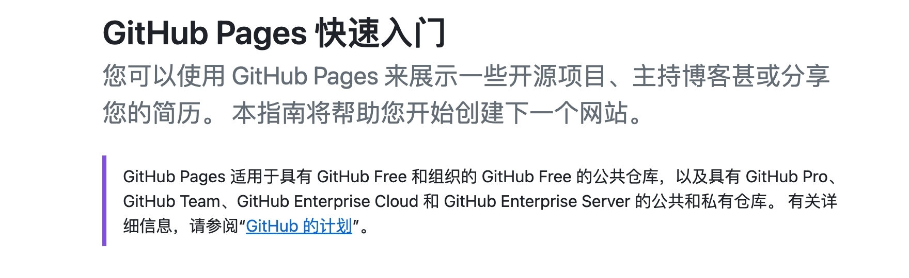
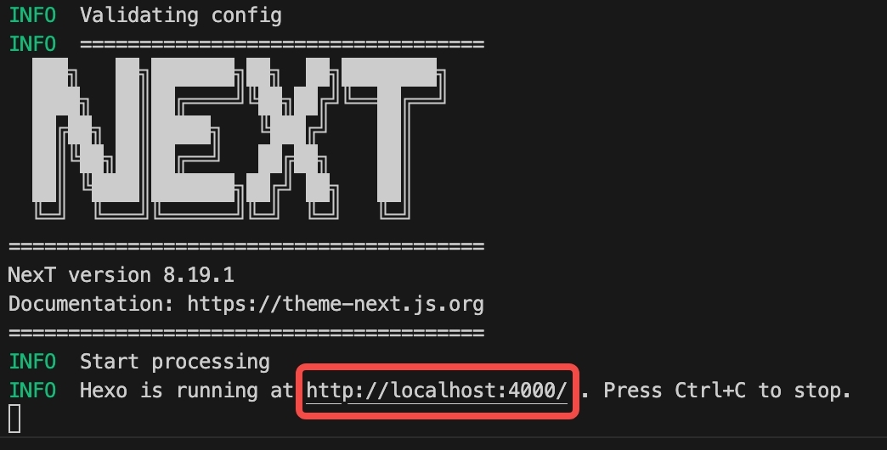

&emsp;&emsp;今天完成了我的个人博客网站的初始化建设，搭建起来的静态网站已经初具形态，并且包括了一些常用的基本功能，在整个搭建过程中，看了不少文章，但不少文章距今已经有不少的一段时间，有不少过期的用法，导致整个搭建过程中遇到了不少阻塞，因此我觉得有必要分享一篇尽可能通用的、保质期长的文章，来尽可能保证读者在使用本文进行个人博客搭建时所遭受的阻碍更少。

&emsp;&emsp;同时我仍然感觉到在这基础上，我仍然需要一些额外的能力，因此我后续会对博客的界面和功能做持续地优化，并会将整个过程收获的心得和方法都收录到 [博客建设](/categories/%E5%8D%9A%E5%AE%A2%E5%BB%BA%E8%AE%BE-%E6%8C%81%E7%BB%AD%E6%9B%B4%E6%96%B0%E4%B8%AD/) 这一分类中。

<!-- more -->

## 前言
&emsp;&emsp;本文分为两个部分为读者讲述如何搭建个人博客网站，第一部分是固定的操作，也就是说在一定意义上讲，该部分涉及到的操作应该是永不过时的；第二部分是需要持续更新的，随着框架（本文中指hexo、next等）的升级，相关的配置和初始化操作也可能发生改变，这部分内容会不定期地进行更新，当然上文中提到，本文旨在提供一个在任何时间都能够尽量保证读者流畅、准确地搭建个人博客的方法，因此除了详细的操作，第二部分也会配合框架的官方文档引导读者进行搭建，这样做可以最大程度保证，即使本文的内容过期，读者也可以使用官方文档进行个人博客网站的搭建。

&emsp;&emsp;下面我们就开始个人博客网站的搭建。

## 第一部分——准备工作
### Node
node.js是git和hexo的基础运行环境，请按照node.js[官方文档](https://nodejs.cn/download/)指示安装好node.js。
### Git
git是github pages的管理工具，请按照git[官方文档](https://git-scm.com/downloads)完成git的安装。
### Github Pages Repository
本文将使用github pages完成博客的托管工作，这是github pages的[官方介绍](https://docs.github.com/zh/pages/quickstart)。


请读者遵照官网的quick start创建好自己的github pages仓库。

## 第二部分——搭建博客
> 以下段落将指引读者使用hexo完成博客的搭建和一些简单的配置，并简单说明hexo的使用方法。
### 安装hexo
> hexo是一个快速、简洁、高效的博客框架。

```bash
npm install hexo-cli -g
```

### 初始化hexo项目
> 按照以下步骤，完成hexo项目的初始化，当然也可以按照[官方文档](https://hexo.io/zh-cn/docs/setup)指示完成项目初始化。

使用hexo对项目进行新建及初始化
```bash
hexo init <folder>
cd <folder>
npm install
```
新建完成后，可使用 `ls <folder>` 或使用ide打开目录，目录结构如下。
```bash
.
├── _config.yml
├── package.json
├── scaffolds
├── source
|   ├── _drafts
|   └── _posts
└── themes
```
**需要特别说明的是**，_config.yml文件是hexo的配置文件，后面我们还可以看到其他类似的文件，为了加以区分，我们称_config.yml文件为**站点配置文件**。
### 本地启动项目
1. 使用`hexo generate`**生成静态文件**，运行此命令后可以看到输出结果里面包含了js、css、html、xml等内容，并可以在根目录下的public目录中找到它们，这些都是被hexo转换后的博客网站的源码。

2. 使用`hexo serve`启动hexo的server，此服务会把博客网站在本地运行起来。访问终端输出中的地址，进入博客网站。



### 部署项目
> hexo提供一键部署命令`hexo deploy`或`hexo d`来进行一键部署，但在运行此命令前我们需要完成一些部署配置。

打开项目的站点配置文件（根目录下的_config.y m l）,找到Deployment的配置项，然后进行如下配置。其中将repo的地址更换为刚刚创建好的github pages仓库地址。
```yml
# Deployment
## Docs: https://hexo.io/docs/one-command-deployment
deploy:
  type: git
  repo: <your repository url>
  branch: master
```

除此之外，我们还需要安装一个Git插件，名为hexo-deployer-git，部署相关的能力将由这个插件提供。

```bash
npm install hexo-deployer-git --save
```

安装完成之后运行`hexo deploy`或`hexo d`，会得到类似以下的输出